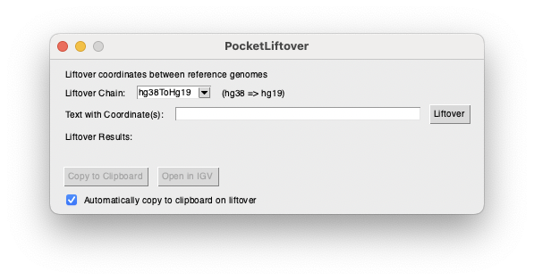
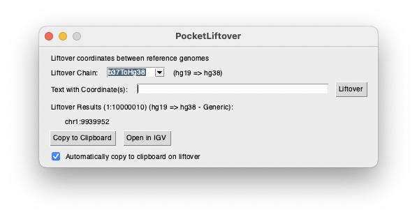

# PocketLiftover
PocketLiftover is a Python GUI application that allows for lifting over of genomic coordinates in a simple copy-paste
style format. Liftover chainfiles can be added to support different reference genome conversions. Additionally,
different search patterns can be added to support different patterns of text that might need to be copied directly
to be lifted over (e.g. ChAS `arr[GRCh37] 16p13.11(15921223_16282869)x3`). After successfully lifting over, you can 
copy the coordinate(s) to your clipboard to paste where they are needed.

## Using PocketLiftover

Once you've [installed your liftover chainfile(s)](#installing-chainfiles) and 
[added your search pattern(s)](#adding-search-patterns), you simply need to select your `Liftover Chain` from the
dropdown menu, paste your copied text containing the coordinates to lift over, and either press Enter or the `Liftover`
button. You'll be presented with the results of the liftover and provided an output formatted as 
`[chr]{chrom}:{start}[-{end}]` (e.g. `chr1:10000000` or `1:10000000-10000020`). The `chr` prefix is removed from all
coordinates lifted to `hg19` and added to all others.

The results line will include the original coordinate(s) as well as the reference genomes and the matching pattern label.

## Setup

Chainfiles and Search Patterns are configured in the `File` -> `Preferences` windows. Please use them to configure
your application. Configuration data (as well as localized chainfiles) are saved in your application data directory,
as defined by the [AppDirs](https://github.com/ActiveState/appdirs) Python package.

### Liftover Chainfiles
Liftover uses chainfiles that map coordinates from one genomic reference genome to another. Liftover chainfiles can be
downloaded from certain institutions, or you might be able to create your own with external projects 
(e.g. [pyOverChain](https://github.com/tao-bioinfo/pyOverChain))

#### Example Chainfiles
- [UCSC](https://hgdownload.soe.ucsc.edu/downloads.html)
- [Ensembl](http://ftp.ensembl.org/pub/assembly_mapping/) 
- [GATK version of UCSC](https://github.com/broadinstitute/gatk/blob/master/scripts/funcotator/data_sources/gnomAD/b37ToHg38.over.chain)

#### Installing Chainfiles
To install a chainfile, open `File` -> `Preferences`, navigate to the `Chainfiles` tab, and click `Add Chainfile`

In the Chainfile Info popup, fill out information about your chainfile and click `Save Chainfile`:

_Note: To save the chainfile to your local application preferences location, leave `Save chainfile to local preferences` checked._

### Search Patterns
Search patterns use Python regular expressions (regex) to extract genomic coordinates from text strings provided as input.

#### Example Search Patterns:
- Generic `(?P<chrom>((?:chr)?[0-9xXyY]+))(?::(?P<start>[0-9]+))(?:-(?P<end>[0-9]+))?`
- ChAS `arr\[(?P<ref>.*)\]\s(?P<chrom>\w+)(?:p|q).*\((?P<start>[0-9]+)_(?P<end>[0-9]+).*`

#### Adding Search Patterns
To add a pattern, open `File` -> `Preferences`, navigate to the `Search Patterns` tab, and click `Add Search Pattern`:

In the Search Pattern Info popup, give your search pattern a (short) label and add the regex:

